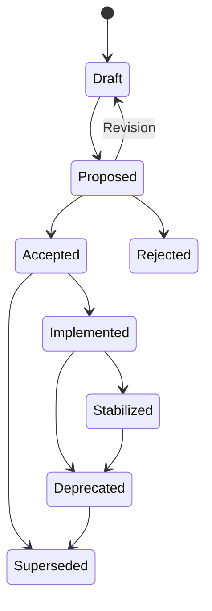

# IndustrialMDE RFC Index and Governance

**Status:** Proposed

**Version:** 0.1

**Created:** 2026-07-19

## 1. Purpose and Current Authority

This document proposes the governance process for IndustrialMDE language and public-contract RFCs and provides the canonical RFC index.

While this document remains Proposed, its detailed lifecycle rules are a review artifact. Approved Project Constitution version 2.1 is authoritative and already establishes the RFC/ADR boundary, authority hierarchy, and requirement for a canonical RFC index. This document becomes an Accepted normative lifecycle contract only through explicit project-owner approval.

## 2. Document Authority

The proposed authority order is:

1. Project Constitution;
2. Accepted RFCs;
3. Accepted ADRs;
4. compiler and tooling specifications;
5. implementation and tests.

A lower-level document MUST NOT override a higher-level document. A conflict requires rejection, revision, or an explicit amendment to the higher-level document.

## 3. RFC and ADR Boundary

| Concern | RFC | ADR |
| --- | --- | --- |
| Language syntax and lexical rules | Yes | No |
| Language semantics and execution behavior | Yes | No |
| User-visible type and conversion rules | Yes | No |
| Required diagnostics and compatibility behavior | Yes | No |
| Public package, target, or plugin contracts | Yes | Implementation details only |
| Compiler implementation language | No | Yes |
| Parser framework | No | Yes |
| Internal data structures and serialization | Public contract only | Yes |
| Process topology and sandbox technology | Required capabilities only | Yes |
| Template or rendering library | No | Yes |

Implementation notes MAY appear in an RFC only when clearly marked non-normative.

## 4. Normative Keywords

- **MUST** and **MUST NOT** define mandatory requirements.
- **SHOULD** and **SHOULD NOT** define strong recommendations that require documented justification when not followed.
- **MAY** defines an optional capability.

Normative keywords apply only when written in uppercase.

## 5. RFC Lifecycle

| Status | Meaning |
| --- | --- |
| Draft | Actively being written; incomplete and non-normative |
| Proposed | Complete enough for architectural review; non-normative |
| Accepted | Semantics explicitly approved; normative within its declared version scope |
| Implemented | At least one implementation claims conformance to the Accepted RFC |
| Stabilized | Behavior is treated as a durable public compatibility contract |
| Deprecated | Still supported within the published policy but no longer recommended |
| Superseded | Replaced by another identified RFC or amendment |
| Rejected | Reviewed and not accepted |

`Implemented` and `Stabilized` are lifecycle states, not evidence by themselves. Conformance evidence and test results must be referenced from the RFC.

Documents listed as **Not Drafted** in the index do not yet have an RFC lifecycle status because no RFC file exists.

## 6. Status Transitions

Rules:

- Authors MAY move a document between Draft and Proposed while addressing review feedback.
- Only explicit project-owner approval recorded in the repository may move an RFC to Accepted.
- Accepted does not imply Implemented.
- Implemented requires a referenced implementation and conformance evidence.
- Stabilized requires compatibility examples, a conformance suite, and an explicit stabilization review.
- An Accepted or Stabilized RFC MUST NOT be edited to introduce a silent semantic change. Use a versioned amendment or superseding RFC.
- Rejected and Superseded RFC files remain in the repository for traceability.

## 7. Required RFC Header

Every RFC file must declare:

- RFC number;
- title;
- status;
- authors or responsible owner;
- creation and last-update dates;
- target language version or version range;
- dependencies;
- supersedes and superseded-by relationships;
- implementation status;
- review or pull-request reference.

Use [`RFC-TEMPLATE.md`](RFC-TEMPLATE.md) for new RFCs.

## 8. Review Requirements

Before an RFC may become Proposed, it must contain:

- motivation, goals, and non-goals;
- terminology consistent with the project glossary;
- normative semantic rules;
- deterministic behavior requirements;
- compatibility and migration impact;
- safety and security considerations;
- unresolved questions;
- positive, negative, and boundary examples;
- expected diagnostic behavior for key invalid cases.

Before an RFC may become Accepted:

- dependencies must exist and have compatible status;
- conflicts with the Constitution must be resolved;
- naming and terminology must be consistent across dependencies;
- each normative rule must be testable or explicitly identified as a review-only contract;
- material objections must be resolved or explicitly deferred;
- project-owner approval must be recorded.

## 9. Examples and Conformance

Each foundational RFC SHOULD provide:

- positive examples;
- negative examples;
- boundary examples;
- compatibility examples where versioning is relevant.

Examples begin as executable specifications. They SHOULD later serve as parser fixtures, semantic conformance cases, diagnostic golden tests, and regression tests.

An example does not establish semantics that are absent from the governing RFC.

## 10. Change and Supersession Policy

- Draft and Proposed RFCs MAY change incompatibly while review history remains available.
- Accepted RFCs MAY receive editorial corrections that do not alter behavior.
- Semantic changes to an Accepted RFC require an explicit amendment with compatibility analysis.
- Breaking changes to Stabilized behavior require the compatibility process defined by the Constitution and a major language-version boundary unless an approved safety or security exception applies.
- A superseding RFC must identify the exact documents and behavior it replaces.

## 11. Canonical RFC Index

| RFC | Title | Document status | Dependencies | Implementation |
| --- | --- | --- | --- | --- |
| [RFC-0000](RFC-0000-Language-Design-Principles.md) | Language Design Principles | Proposed | Constitution | Not Started |
| [RFC-0001](RFC-0001-Core-Language.md) | Core Language and Lexical Structure | Proposed | RFC-0000 | Not Started |
| [RFC-0001A](RFC-0001A-Semantic-Object-Model.md) | Semantic Object Model | Proposed | RFC-0000, RFC-0001 | Not Started |
| RFC-0001B | Identifiers, Scopes, and Namespaces | Not Drafted | RFC-0000, RFC-0001, RFC-0001A | Not Started |
| RFC-0001C | Compilation Units, Modules, Packages, and Dependencies | Not Drafted | RFC-0000, RFC-0001B | Not Started |
| RFC-0002 | Type System | Not Drafted | RFC-0001A, RFC-0001B, RFC-0001C | Not Started |
| RFC-0003 | Literals, Expressions, and Operators | Not Drafted | RFC-0002 | Not Started |
| RFC-0004 | Execution Model and Bounded Semantics | Not Drafted | RFC-0002, RFC-0003 | Not Started |
| RFC-0005 | Signals, Ports, Connections, and Data Flow | Not Drafted | RFC-0002, RFC-0004 | Not Started |
| RFC-0006 | Composition, Definitions, Instances, and Interfaces | Not Drafted | RFC-0001A, RFC-0002, RFC-0005 | Not Started |
| RFC-0007 | Deployment, Hardware Mapping, and Target Abstraction | Not Drafted | RFC-0005, RFC-0006 | Not Started |
| RFC-0008 | Recipes and Parameter Sets | Not Drafted | RFC-0002, RFC-0004, RFC-0006 | Not Started |
| RFC-0009 | State Machines and Sequences | Not Drafted | RFC-0004, RFC-0006 | Not Started |
| RFC-0010 | Alarms, Events, and Diagnostics | Not Drafted | RFC-0004, RFC-0005, RFC-0009 | Not Started |
| RFC-0011 | Standard Library | Not Drafted | RFC-0002 through RFC-0010 as applicable | Not Started |
| RFC-0012 | Canonical Intermediate Representation | Not Drafted | Accepted semantic RFC subset required by its scope | Not Started |
| RFC-0013 | Compiler Pipeline and Validation | Not Drafted | RFC-0012 | Not Started |
| RFC-0014 | Grammar Specification | Not Drafted | Accepted syntax and semantic RFC subset | Not Started |
| RFC-0015 | Plugin and Target Extension Model | Not Drafted | RFC-0007, RFC-0012, RFC-0013 | Not Started |

The index records intended dependency direction, not acceptance. Dependencies must be revalidated while each RFC is drafted.

## 12. Initial Decision Gates

The following decision gates remain:

- the exact reference-spike subset and disposal policy;
- the RFC-0001B scope, namespace, import, and collision contracts;
- the RFC-0001C compilation-unit, package, and dependency contracts;
- conformance of every foundational RFC with Approved Constitution 2.1 before RFC acceptance;
- conformance evidence required before the foundational RFCs may become Accepted.

These questions must be resolved by the relevant RFCs rather than by examples or compiler implementation.
