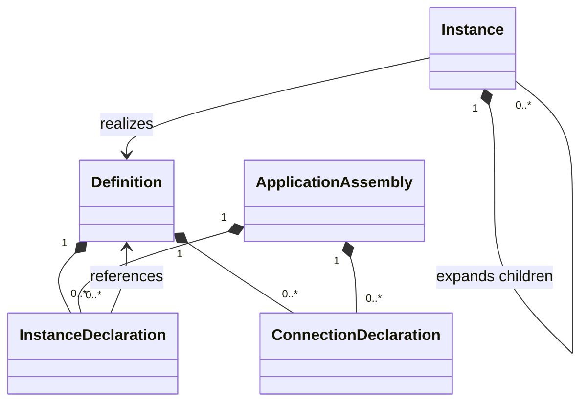

# RFC-0001A: Semantic Object Model

**Status:** Proposed

**Authors:** IndustrialMDE Project

**Created:** 2026-07-19

**Last Updated:** 2026-07-19

**Target Language Version:** Pre-1.0

**Dependencies:** RFC-0000, RFC-0001

**Supersedes:** None

**Superseded By:** None

**Implementation Status:** Not Started

**Review:** [Foundational RFC Review Decisions](../../00_Project_Brain/06_Foundational_RFC_Review_Decisions.md)

## 1. Summary

This RFC defines the foundational semantic entities of IndustrialMDE before the type system, execution model, grammar, and compiler representations are designed.

The proposal adopts a small Core Semantic Kernel based on reusable `Definition` declarations, static `InstanceDeclaration` composition sites, expanded `Instance` occurrences, explicit member categories, and first-class `ConnectionDeclaration` relationships. Industrial terms such as Plant, Equipment, Device, and Component are profile roles layered over the kernel rather than universal compiler node kinds.

The RFC also separates reusable domain definitions, target-neutral application assembly, and target-specific deployment mapping. Package, module, namespace, type, expression, execution, and hardware-mapping details remain owned by later RFCs.

RFC-0000 and RFC-0001 are currently Proposed. This RFC may be reviewed as Proposed while its dependencies are at compatible review status. It cannot become Accepted until its normative dependencies are Accepted.

## 2. Motivation

The earlier object-model sketch used this hierarchy as if it were the universal language metamodel:

```text
Project
└── Plant
    └── Area
        └── ProcessCell
            └── Unit
                └── Equipment
                    └── ControlModule
                        └── Component / Atom / Device
```

That hierarchy is recognizable in process and batch automation, but it is not universal. OEM machines, conveyors, robotics, building automation, power distribution, warehouse systems, and small skids require different structural vocabularies.

The sketch also did not distinguish:

- a reusable declaration from an occurrence of that declaration;
- an instance declaration in source from an expanded semantic instance;
- a physical Device role from a structural Component role;
- reusable domain structure from project-specific deployment mappings;
- a connection relationship from a direct pointer stored on one endpoint;
- compile-time constants, configuration parameters, runtime signals, and owned state.

Those distinctions must be stable before scopes, types, execution, IR, or parser objects are designed.

## 3. Goals

This RFC is intended to:

- define a small, domain-independent semantic kernel;
- distinguish definitions, instance declarations, instances, and references;
- make static composition finite and deterministic;
- define canonical semantic member categories without defining their full type or runtime behavior;
- make connections first-class, traceable semantic relationships;
- separate semantic entity kinds from industrial profile roles;
- distinguish Component, Device, Primitive, and the rejected Atom synonym;
- separate reusable domain models, target-neutral application assemblies, and deployment models;
- prohibit target mappings inside reusable definitions;
- establish deterministic identity and expansion requirements;
- provide a stable foundation for RFC-0001B, RFC-0001C, RFC-0002, RFC-0005, RFC-0006, and RFC-0007.

## 4. Non-Goals

This RFC does not define:

- final source syntax or grammar productions;
- package, module, library, project-manifest, or dependency semantics;
- namespace, import, visibility, scope, shadowing, or name-resolution rules;
- built-in types, user-defined value types, literals, conversions, or units;
- parameter expression evaluation or override syntax;
- endpoint direction, signal sampling, quality, or connection type compatibility;
- scan-cycle, event, scheduling, behavior, or state-update semantics;
- interface conformance or substitution rules;
- inheritance, mixins, traits, or implementation reuse;
- hardware, memory, task, or vendor mapping semantics;
- attribute syntax, registration, or plugin-defined annotations;
- recipes, alarms, state machines, diagnostics models, or PackML;
- the concrete schema of AST, Semantic Model serialization, Canonical IR, or Target IR;
- a complete ISA-88, ISA-95, or other standards profile.

## 5. Terminology

This RFC uses terms from the [IndustrialMDE Glossary](../Glossary.md).

### 5.1 Core Terms

- **Definition** — a named, reusable compile-time declaration of structure and semantic members.
- **Member Declaration** — an ownership category for a declaration owned by one Definition and instantiated or interpreted in that Definition's context.
- **Instance Declaration** — a static composition site that references one Definition.
- **Instance** — an immutable semantic occurrence produced by expanding a root or member Instance Declaration.
- **Application Assembly** — a target-neutral root that selects root instances and application-specific logical relationships.
- **Connection Declaration** — a first-class declaration relating endpoint references within one composition context.
- **Semantic Entity Kind** — a compiler-recognized kernel category such as Definition or Instance.
- **Profile Role** — a qualified classification or contextual role applied to an eligible semantic entity without changing its kernel kind.
- **Industrial Profile** — a versioned semantic profile that supplies industrial role vocabulary and validation constraints.
- **Target Profile** — a target capability and lowering contract; it is not an Industrial Profile.
- **Expansion** — deterministic creation of the finite Instance tree implied by static Instance Declarations.
- **Declaration Identity** — stable identity of a declaration in the resolved source model.
- **Instance Identity** — stable identity of an expanded occurrence derived from its root and member-declaration path.

### 5.2 Terms That Are Not Synonyms

- A Definition is not an Instance.
- An Instance Declaration is not an expanded Instance.
- A Component role is not a Device role.
- A Primitive classification is not a separate kernel entity kind.
- A Package or Library is not a Definition.
- A Project is not a universal industrial hierarchy node.
- A Mapping is not a reusable domain member.
- An external engineering tag is not semantic identity.
- Atom is not a canonical IndustrialMDE term.

## 6. Normative Specification

### 6.1 Semantic Planes

The resolved source model MUST distinguish three semantic planes:

| Plane | Purpose | Target-specific content permitted |
| --- | --- | --- |
| Domain Definition Plane | Reusable definitions and their declared members | No |
| Application Assembly Plane | Target-neutral root instances, logical configuration, and application-level connections | No |
| Deployment Plane | Target selection, hardware bindings, memory and task intent, and deployment values | Yes, through declared target contracts |

The planes MAY be authored in separate files, modules, or packages. Their compilation-unit ownership is deferred to RFC-0001C.

A Project is the build and orchestration boundary defined by RFC-0001C. This RFC does not make Project an instantiable Definition or an industrial hierarchy role.

A Project MAY contain zero or more named Application Assemblies. An Application Assembly is a target-neutral semantic graph root and MUST NOT be treated as a synonym for Project or Definition.

Each Deployment Model in the foundational model MUST reference exactly one Application Assembly. A later RFC may define coordinated multi-assembly deployment without changing their independent semantic identities.

A Library is a published collection or distribution concept defined by RFC-0001C. A Project MUST reference package or library dependencies explicitly rather than pretending to contain global libraries as semantic children.

### 6.2 Core Semantic Kernel

The Core Semantic Kernel consists of the following entity kinds and abstract ownership categories:

| Entity kind | Purpose | Runtime occurrence |
| --- | --- | --- |
| Definition | Reusable declaration and member owner | No |
| Application Assembly | Target-neutral composition root | No |
| Member Declaration | Abstract ownership category for Definition-owned declarations | No |
| Instance Declaration | Static reference to one Definition at a composition site | Produces Instance occurrences |
| Instance | Expanded occurrence associated with one Definition | Yes, where generated behavior requires it |
| Constant Declaration | Compile-time immutable named value | No mutable occurrence |
| Parameter Declaration | Per-instance configuration input | Effective value per Instance |
| Endpoint Declaration | Per-instance interaction endpoint | Endpoint occurrence per Instance |
| State Declaration | Per-instance behavior-owned storage | State occurrence per Instance |
| Behavior Declaration | Bounded behavior owned by a Definition | Behavior occurrence per Instance |
| Connection Declaration | Explicit relationship between endpoint references | Connection occurrence per expansion context |
| Annotation | Registered descriptive or extension data | Only if its governing contract says so |
| Profile Role Assignment | Explicit application of a qualified role to an eligible semantic entity | No independent runtime occurrence |
| Deployment Model | Target-specific binding root | Deployment-time only |
| Deployment Mapping | Relationship from logical identity to target resource | Deployment-time only |

This is a semantic taxonomy, not a required class hierarchy in an implementation. An Instance Declaration or Connection Declaration owned by a Definition is a Member Declaration in that context. The same entity kind owned by an Application Assembly is an application entry rather than a Definition member.

Interface declarations and conformance are reserved for RFC-0006. Recipes, alarms, events, and state machines may introduce additional member categories only through their Accepted RFCs.

The relationship is summarized below:



### 6.3 Definition

A Definition MUST:

- have one stable Declaration Identity after name resolution;
- own an ordered collection of zero or more Member Declarations;
- be independent of any particular expanded Instance;
- be independent of target addresses, vendor memory areas, vendor tasks, and generated target names;
- preserve source traceability for itself and each member;
- declare all structural composition through Instance Declarations.

A Definition MAY have no members. A profile MAY impose stronger requirements for a particular role.

A reusable Definition MUST be named. Anonymous semantic definitions are permanently prohibited as a core identity invariant because they break deterministic identity, reuse, diagnostics, compatibility, and incremental invalidation. Reconsidering this invariant requires a superseding RFC and the managed major-version process. Naming and qualification syntax are owned by RFC-0001B.

A Definition MUST NOT:

- contain an expanded Instance as source-owned mutable state;
- contain another Definition inline;
- inherit members from another Definition;
- add members conditionally at runtime;
- contain a Deployment Mapping;
- contain a vendor-specific address or project object as core semantic structure;
- gain members through undocumented parser or plugin behavior.

A later RFC may define explicit generic specialization or bounded static replication. Until then, every Instance Declaration has cardinality exactly one and every Definition's member set is statically fixed.

### 6.4 Member Declaration

Every Definition-owned Member Declaration MUST:

- belong to exactly one Definition;
- have one declaration kind;
- have a stable Declaration Identity within the owning Definition;
- preserve a primary source span;
- participate in deterministic source or canonical declaration ordering;
- declare all semantic dependencies explicitly.

A declaration MUST NOT change kind after name resolution. For example, a Parameter Declaration cannot become a State Declaration because of target selection.

The same source spelling MUST NOT be represented simultaneously as multiple member kinds to postpone an ambiguity. Ambiguous or conflicting declarations produce diagnostics.

Member names, duplicate rules, and cross-category collision rules are deferred to RFC-0001B.

### 6.5 Instance Declaration

An Instance Declaration is a Definition-owned Member Declaration or Application Assembly entry that establishes a static composition edge.

Every Instance Declaration MUST:

- reference exactly one resolved Definition;
- have one stable Declaration Identity;
- have cardinality exactly one in this RFC;
- identify its enclosing Definition or Application Assembly;
- preserve the source span of the declaration and the source span of the referenced Definition;
- participate in containment-cycle analysis;
- expand deterministically in every applicable parent Instance context.

An Instance Declaration MAY carry configuration bindings and contextual profile roles when later RFCs define those facilities.

An Instance Declaration MUST NOT:

- add arbitrary members that are absent from the referenced Definition;
- remove members from the referenced Definition;
- change the referenced Definition at runtime;
- select its Definition through runtime dispatch;
- create a variable number of child Instances;
- contain an anonymous inline Definition;
- mutate the referenced Definition.

Instance-specific structural extension is prohibited. Reusable variants must be represented by another named Definition composed from explicit members or by a future, fully specified specialization mechanism.

### 6.6 Expanded Instance

An Instance is produced by semantic expansion; it is not a mutable parser object.

Every expanded Instance MUST contain:

- one stable Instance Identity;
- a reference to exactly one resolved Definition;
- a reference to the Instance Declaration that created it;
- an optional parent Instance Identity, absent only for a root Instance;
- an ordered collection of child Instances produced by member Instance Declarations;
- occurrences of the Definition's per-instance semantic members;
- complete source-origin traceability through the declaration path.

An Instance MUST NOT own structural members that cannot be traced to its Definition or an explicitly permitted application-level binding.

Two Instance Declarations referencing the same Definition produce distinct Instances with distinct Instance Identities.

Changing an external engineering tag MUST NOT change Instance Identity. Renaming a declaration or moving it to another semantic owner MAY change identity and is therefore compatibility-significant.

### 6.7 Expansion Algorithm and Finiteness

For each root Instance Declaration, semantic expansion recursively applies these rules:

1. create one Instance associated with the declaration's resolved Definition;
2. create per-instance occurrences for the Definition's applicable members;
3. visit child Instance Declarations in deterministic member order;
4. create one child Instance for each child declaration;
5. expand Definition-level Connection Declarations in the current Instance context;
6. continue until every reachable child declaration is expanded.

The Definition containment graph induced by Instance Declarations MUST be acyclic.

If Definition `A` declares an Instance of `B`, and `B` directly or transitively declares an Instance of `A`, compilation MUST fail. The compiler MUST NOT attempt partial or depth-limited expansion as recovery for a semantic cycle.

Forward references between declarations MAY be supported by RFC-0001B and RFC-0001C, but they do not permit containment cycles.

Implementations MUST apply declared limits to expansion depth and total expanded entity count. Exceeding a configured limit is an error and MUST NOT produce partial generation output.

A production compiler claiming baseline conformance MUST support an expansion depth of at least 64 and at least 262,144 total expanded semantic entities per Application Assembly. It MAY provide explicitly selected restricted resource profiles with lower limits, but it MUST report that those profiles do not satisfy the baseline capacity. A Reference Spike MAY use lower limits only while declaring itself non-conforming.

### 6.8 Semantic Value Categories

The following categories are distinct even before their full type and execution rules exist:

| Category | Established no later than | Runtime assignment by generated behavior | Storage intent |
| --- | --- | --- | --- |
| Constant | Compile time | Prohibited | No mutable storage required |
| Parameter | Configuration or initialization | Prohibited | Target-dependent configuration storage |
| Endpoint | Runtime execution | Governed by data-flow and execution RFCs | Runtime data exchange |
| State | Runtime execution | Permitted only to owning bounded behavior | Runtime owned storage |
| Retention policy | Deployment or initialization | Does not create a new value category | Modifies State storage policy |
| Metadata property | Design time | Prohibited | No runtime storage implied |
| Recipe field | Recipe contract | Governed by RFC-0008 | Not a core member category |

A Constant is compile-time immutable.

A Parameter configures an Instance. Its effective value MUST be fixed before the first execution step and MUST remain immutable during execution. A future runtime configuration facility must introduce an explicit value category and bounded transaction contract rather than silently weakening Parameter semantics. A runtime-tunable value cannot be treated as both Parameter and State.

Endpoint is the sole neutral Core Semantic Kernel term for interaction with another entity or environment. Port, Signal, direction, sampling, quality, update timing, and type compatibility are deferred to RFC-0005.

State and Behavior remain foundational member categories so that ownership and structural identity are available before execution lowering. Their runtime semantics are owned by RFC-0004. A retention or persistence declaration is a storage policy on State, not a synonym for State and not a new identity kind.

Persistence across schema changes, software upgrades, or hot swap requires stable storage identity and migration semantics. No `persistent` facility is authorized until those contracts are defined.

Metadata MUST NOT alter resolution, typing, execution, or deployment selection unless an Accepted registered-annotation contract explicitly says otherwise.

### 6.9 Connection Declaration

A Connection Declaration is a first-class semantic relationship. It MUST NOT be represented only as a mutable pointer stored on one Endpoint.

Every Connection Declaration MUST preserve:

- one stable Declaration Identity;
- one enclosing Definition or Application Assembly;
- one explicit source Endpoint reference;
- one explicit destination Endpoint reference;
- the source spans of the declaration and both references;
- deterministic ordering within its enclosing context;
- an explicit conversion or transformation reference if a later RFC permits one.

A Definition-level Connection Declaration acts as a template. It produces one Connection occurrence in each expanded Instance context of that Definition.

A Connection MUST relate Endpoint occurrences in one valid composition context. It MUST NOT connect two Definition declarations as though they were runtime occurrences.

Fan-out is represented by multiple Connection Declarations. Hyperedges, implicit broadcast, implicit conversion, and multiple-driver conflict resolution are not authorized by this RFC.

Direction, type compatibility, units, quality, sampling, timing, cycle analysis, and driver-count validation are owned by RFC-0005 and RFC-0004.

This RFC defines no Connection transformation semantics. RFC-0005 may introduce an explicit, source-traceable transformation contract. Target lowering MUST NOT invent a hidden transformation.

### 6.10 Typed Semantic References

After name resolution, the Semantic Model MUST distinguish at least:

- Definition Reference;
- Instance Declaration Reference;
- Instance Reference;
- Member Declaration Reference;
- Endpoint Reference;
- Deployment Resource Reference;
- Profile Role Reference.

A resolved reference MUST encode its expected and actual target kind. Compiler phases MUST NOT pass unresolved source strings to target lowering as substitutes for semantic references.

Using a Definition where an Instance is required, an Instance where an Endpoint is required, or a domain entity where a deployment resource is required is an error even when the source spellings are identical.

Reference spelling, qualification, accessibility, aliases, and resolution order are deferred to RFC-0001B and RFC-0001C.

### 6.11 Semantic Profiles

A Semantic Profile is a named and versioned extension contract layered over the Core Semantic Kernel.

A Semantic Profile MAY declare:

- qualified Profile Roles;
- the kernel entity kinds eligible for each role;
- role-specific structural constraints;
- allowed or prohibited child-role relationships;
- required or prohibited member categories;
- additional deterministic validation rules;
- documented source-syntax sugar when an Accepted syntax RFC authorizes it.

A Semantic Profile MUST:

- preserve core entity kinds and identities;
- use qualified role identities that cannot collide silently;
- declare its version and compatibility range;
- produce deterministic validation results;
- preserve source traceability for role assignments;
- state whether each rule is structural, behavioral, deployment-related, or documentation-only.

A Semantic Profile MUST NOT:

- redefine Definition, Instance, Connection, or another core entity kind;
- change core name-resolution, type, or execution rules silently;
- introduce runtime object creation or unbounded structure;
- mutate published Semantic Model artifacts;
- embed vendor-specific target semantics in a vendor-neutral industrial role;
- execute arbitrary profile code merely because a source model references the profile.

Executable validators and plugins, if later permitted, require the capability and trust contracts defined by RFC-0015. Their behavior must still conform to the profile's published semantic contract.

### 6.12 Role Assignment

A Profile Role classifies an eligible semantic entity; it does not replace the entity's kernel kind.

Every Role Assignment MUST identify:

- the qualified role identity and profile version;
- the target semantic entity;
- the assignment source span or explicit generated origin;
- the role category defined by the profile;
- all constraints activated by the assignment.

A Definition classification role applies to every expanded Instance of that Definition unless the profile explicitly defines a compatible refinement rule.

An Instance Declaration MAY carry a contextual containment role. Such a role describes how the occurrence participates in its parent composition; it does not change the classification of the referenced Definition.

Within one profile namespace and role category, an entity MUST receive at most one role. A profile MAY define multiple distinct role categories. Cross-profile role composition is permitted only when every involved profile declares it compatible.

Profiles MUST NOT infer a safety-relevant role from an identifier spelling, external tag, directory path, or target address.

### 6.13 Initial Industrial Role Vocabulary

This Proposed RFC standardizes the qualified profile namespace `industrial.structure` as the foundational target-neutral industrial structure profile.

The proposed role vocabulary is:

| Role | Eligible kernel kind | Meaning |
| --- | --- | --- |
| `industrial.structure.Plant` | Definition | Industrial site or facility assembly |
| `industrial.structure.Area` | Definition | Logical or physical facility subdivision |
| `industrial.structure.ProcessCell` | Definition | Process-oriented production subdivision |
| `industrial.structure.Unit` | Definition | Independently meaningful process or machine unit |
| `industrial.structure.Equipment` | Definition | Functional industrial assembly or skid |
| `industrial.structure.ControlModule` | Definition | Coordinated control assembly |
| `industrial.structure.Device` | Definition | Physical asset or device-abstraction boundary |
| `industrial.structure.Primitive` | Definition | Leaf library definition with no child Instance Declarations |
| `industrial.structure.Component` | Instance Declaration | Contextual role for a nested static occurrence |

These roles do not become separate AST, Semantic Model, or Canonical IR node kinds.

`Component` and `Device` are intentionally different:

- Component classifies an Instance Declaration's structural relationship to its parent;
- Device classifies the referenced Definition and its expanded Instances as a physical or device-abstraction boundary.

An Instance Declaration may therefore be a Component occurrence of a Device Definition without semantic ambiguity.

Primitive remains an `industrial.structure` classification of a Definition whose structural child count is zero, not a kernel kind. A standard library MAY apply the role. A Primitive Definition may still declare Parameters, Endpoints, State, Behavior, and Connections permitted by its profile.

Atom is not a role, declaration kind, or synonym. New normative text and source syntax MUST NOT use it.

This RFC does not impose one universal parent-role hierarchy for the initial vocabulary. Process, machine, building, power, and logistics role-containment matrices require separate versioned profile contracts. Such a matrix is profile validation, not Core Semantic Kernel containment.

### 6.14 Core Containment Matrix

The following matrix defines direct semantic containment in the kernel:

| Parent | Allowed direct semantic children |
| --- | --- |
| Definition | Constant, Parameter, Endpoint, State, Instance, Behavior, and Connection Declarations; registered Annotations and Role Assignments |
| Application Assembly | Root Instance Declarations, application-level Connection Declarations, configuration clauses defined by later RFCs, Annotations, and Role Assignments |
| Instance Declaration | Configuration bindings, endpoint bindings, contextual Role Assignments, and Annotations defined by later RFCs; no new structural members |
| Expanded Instance | Expanded child Instances and expanded member occurrences derived from its Definition |
| Deployment Model | Target selections, Deployment Mappings, deployment values, Annotations, and target-profile references |
| Deployment Mapping | Logical references, target resource references, and mapping options defined by RFC-0007 |
| Connection Declaration | Source and destination Endpoint references and an optional explicitly authorized transformation reference |

An entity not listed as an allowed child MUST NOT be inserted by a parser, profile, plugin, compiler pass, or target lowering step.

An Application Assembly MAY declare explicit application-level Connections between root Instances without introducing a wrapper Definition.

The exact source owner of top-level Definitions and Application Assemblies is deferred to RFC-0001C.

### 6.15 Domain and Deployment Separation

Domain Definition and Application Assembly planes MUST remain target-neutral.

A reusable Definition MUST NOT contain:

- PLC addresses or memory offsets;
- vendor project paths;
- vendor task identifiers;
- controller, rack, slot, channel, or network bindings;
- target-generated symbol names;
- target-specific memory packing;
- a Deployment Mapping.

A Deployment Model MAY reference resolved logical identities from an Application Assembly and bind them to target resources under one declared Target Profile.

A Deployment Mapping MUST NOT add, remove, or replace logical Instances, Endpoints, State, Connections, or Behavior. It binds an already valid logical model to target resources.

The same Domain Definition and Application Assembly MAY participate in multiple separate Deployment Models when their selected target profiles support the required capabilities.

External tags and asset identifiers MAY belong to reusable or application-level descriptive data when their registered contracts are target-neutral. A generated vendor symbol belongs to target lowering and traceability, not semantic identity.

### 6.16 Industrial Source Sugar and Lowering

A future syntax RFC MAY introduce domain-readable declarations such as `equipment`, `device`, or `component`.

Such syntax MUST lower deterministically to Core Semantic Kernel entities plus explicit Profile Role Assignments. It MUST NOT create parallel semantic entity kinds.

Conceptually:

```text
equipment PumpStation { ... }
```

lowers to:

```text
Definition PumpStation
Role industrial.structure.Equipment on PumpStation
```

and:

```text
component main_pump : MotorVfd;
```

lowers to:

```text
InstanceDeclaration main_pump references MotorVfd
Role industrial.structure.Component on main_pump
```

These sketches do not establish final grammar.

### 6.17 Validation and Diagnostics

The following diagnostic codes are defined by this Proposed revision:

| Code | Severity | Condition | Required diagnostic facts |
| --- | --- | --- | --- |
| `IMDE2001` | Error | Definition containment cycle | Every participating Instance Declaration and the cycle path |
| `IMDE2002` | Error | Instance Declaration resolves to a non-Definition | Declaration span, reference span, and actual target kind |
| `IMDE2003` | Error | Instance-specific structural member added or removed | Instance Declaration and unauthorized member |
| `IMDE2004` | Error | Deployment Mapping or target binding inside a Domain Definition or Application Assembly | Mapping span and enclosing logical owner |
| `IMDE2005` | Error | Profile Role applied to an ineligible kernel entity kind | Assignment, role, expected kinds, and actual kind |
| `IMDE2006` | Error | Profile structural or child-role constraint violation | Parent, child, role identities, and violated rule |
| `IMDE2007` | Error | Connection uses a non-Endpoint reference or invalid composition context | Connection and all invalid reference spans |
| `IMDE2008` | Error | Runtime, conditional, or unbounded instance creation requested | Creation construct and bounded static alternative when applicable |
| `IMDE2009` | Error | Semantic reference kind mismatch | Expected kind, actual kind, and declaration locations |
| `IMDE2010` | Error | Conflicting Role Assignments | Conflicting assignments and governing profile rule |
| `IMDE2011` | Error | Expansion depth or entity-count limit exceeded | Root Instance Declaration, active limit, and expansion path |

Duplicate names, inaccessible references, ambiguous imports, and shadowing are owned by RFC-0001B. Unknown packages and cyclic package dependencies are owned by RFC-0001C.

Diagnostics MUST follow RFC-0000 ordering and source-span requirements. A cycle diagnostic MUST select one deterministic primary edge and report the remaining cycle edges as ordered related information.

A compiler MAY continue semantic analysis with an invalid placeholder, but no invalid or partially expanded Instance tree may reach Canonical IR generation.

## 7. Determinism and Ordering

### 7.1 Declaration Ordering

Member Declarations within one Definition retain declared source order unless a later RFC defines an explicit order independent of source order.

Cross-file Definition ordering is determined by canonical qualified identity and compilation-unit rules from RFC-0001B and RFC-0001C. Filesystem discovery order MUST NOT establish semantic order.

### 7.2 Instance Identity

Instance Identity MUST be derived deterministically from:

- the identity of the Application Assembly;
- the root Instance Declaration identity;
- the ordered path of member Instance Declaration identities from the root;
- declared static replication indexes if a future RFC introduces bounded replication.

Instance Identity MUST NOT depend on:

- memory address;
- target-generated name;
- external engineering tag;
- object allocation order;
- random UUID;
- process identifier;
- hash-map iteration;
- compiler concurrency.

The exact serialized identity format is deferred to RFC-0001B, RFC-0001C, and RFC-0012.

Identity is preserved across physical file relocation only when package identity, namespace identity, owning declaration path, and member path remain unchanged. Changing any of those semantic identity components changes the affected Declaration or Instance Identity even if the declaration text is otherwise identical.

### 7.3 Expansion and Connection Ordering

Child Instances MUST be expanded in deterministic Instance Declaration order.

Connection occurrences MUST retain their Connection Declaration order within each expansion context. A target may choose another physical serialization order only when the Target IR preserves semantic identity and observable behavior.

Profile validations MUST execute in a published deterministic order or their diagnostics MUST be normalized to the same observable order.

### 7.4 Diagnostic Ordering

Object-model diagnostics MUST be ordered by:

1. normalized logical source path;
2. primary source start position;
3. diagnostic code;
4. canonical semantic identity;
5. a stable rule-specific secondary key.

RFC-0001C owns logical source-path normalization.

## 8. Compatibility and Migration

### 8.1 Public Structural Surface

The public structural surface of a Definition includes at least:

- its qualified identity;
- profile classification roles;
- public Member Declaration names and kinds;
- Instance Declaration target Definitions;
- Endpoint and Parameter contracts defined by later RFCs;
- interface conformance defined by RFC-0006.

Changing the public structural surface may break consumers even when source syntax still parses.

### 8.2 Identity-Significant Changes

The following changes are compatibility-significant:

- renaming or moving a Definition;
- renaming or moving an Instance Declaration;
- changing an Instance Declaration's referenced Definition;
- inserting, removing, or reordering identity-bearing path segments;
- changing an entity's incompatible Profile Role;
- converting a Parameter to State, an Endpoint to Parameter, or another member-kind change;
- moving a logical mapping into or out of a Deployment Model.

Migration documentation MUST identify affected Instance Identities, deployment mappings, persisted state, and generated target names.

### 8.3 Potentially Compatible Changes

Adding descriptive metadata that has no registered semantics is structurally compatible.

Adding a private member, optional Parameter, child Instance, or Connection is not automatically compatible. It may change memory, resource use, execution, target capabilities, or deployment mappings and must be analyzed under later RFCs.

### 8.4 Profile Evolution

A profile version MUST NOT silently change the kernel kind eligible for a role or reinterpret an existing role in a behaviorally incompatible way.

Breaking profile changes require a version boundary, compatibility analysis, and migration guidance under the project compatibility policy.

## 9. Safety and Security Considerations

- Acyclic static expansion prevents recursive object creation and unbounded composition.
- Typed semantic references prevent a Definition, Instance, Endpoint, or target resource from being substituted silently for another kind.
- Domain and Deployment separation prevents reusable logic from hiding physical output bindings.
- Explicit Connection Declarations support driver, cycle, and traceability analysis in later RFCs.
- Distinct Parameter, Endpoint, and State categories reduce accidental writable-state exposure.
- Qualified Profile Roles prevent name-based role inference and vendor namespace collisions.
- Profiles and annotations must be treated as untrusted data and cannot execute arbitrary code as a consequence of model loading.

These structural guarantees do not prove that a process design, connection, interlock, or deployment is safe. Hazard analysis, safety allocation, commissioning, and target qualification remain external responsibilities unless a specific verified property says otherwise.

## 10. Tooling and Incremental Compilation

### 10.1 Required Traceability

Tooling MUST be able to navigate:

- Definition to all Instance Declarations that reference it;
- Instance Declaration to its expanded Instances;
- expanded Instance to its Definition and declaration path;
- Connection to both Endpoint references and their declarations;
- Profile Role Assignment to its profile rule;
- Deployment Mapping to its logical entity and target resource.

An expanded Instance may have multiple relevant source spans. Diagnostics and IDE views SHOULD distinguish the root declaration, member declaration path, referenced Definition, and active configuration binding.

### 10.2 Semantic Dependency Edges

At minimum, the dependency graph MUST record:

- Instance Declaration to referenced Definition;
- Definition to each referenced member type or contract;
- Connection Declaration to referenced Endpoints;
- Role Assignment to profile and role definition;
- Application Assembly to root Instance Declarations and their referenced Definitions;
- Deployment Mapping to logical identity and Target Profile.

### 10.3 Invalidation

A structural change to a Definition MUST invalidate semantic expansion for every transitively dependent root Instance Declaration.

A profile-rule change MUST invalidate every entity assigned a role from that profile version.

A deployment-only change MUST NOT invalidate parsing or semantic construction of unaffected reusable Domain Definitions, although target validation and lowering may be invalidated.

Public semantic API hashes, content identity, cache keys, and cross-module invalidation are deferred to RFC-0001C and the compiler specification.

## 11. Examples

All source-like examples in this RFC are conceptual and do not establish grammar.

### 11.1 Positive Example: Definition and Instance Declaration

```text
definition MotorVfd {
    endpoint start_command;
    endpoint running_feedback;
}

definition PumpStation role industrial.structure.Equipment {
    instance main_pump : MotorVfd
        role industrial.structure.Component;
}

application WaterTreatment {
    instance station_1 : PumpStation;
    instance station_2 : PumpStation;
}
```

The semantic result contains:

| Instance Identity sketch | Definition | Creating declaration |
| --- | --- | --- |
| `WaterTreatment.station_1` | `PumpStation` | `station_1` |
| `WaterTreatment.station_1.main_pump` | `MotorVfd` | `main_pump` |
| `WaterTreatment.station_2` | `PumpStation` | `station_2` |
| `WaterTreatment.station_2.main_pump` | `MotorVfd` | `main_pump` |

Both `main_pump` occurrences share one Definition and one member Instance Declaration but have distinct Instance Identities.

### 11.2 Positive Example: Device as a Component Occurrence

```text
definition PressureTransmitter role industrial.structure.Device {
    endpoint process_value;
}

definition PumpStation role industrial.structure.Equipment {
    instance outlet_pressure : PressureTransmitter
        role industrial.structure.Component;
}
```

`PressureTransmitter` is classified as a Device Definition. `outlet_pressure` is a Component occurrence within `PumpStation`. No synonym or duplicate semantic node is required.

### 11.3 Positive Example: First-Class Connection

```text
definition PumpStation {
    instance pressure_sensor : PressureTransmitter;
    instance controller : PressureController;

    connection measured_pressure {
        source pressure_sensor.process_value;
        destination controller.process_value;
    }
}
```

The connection has its own identity and traceability. It expands once inside every PumpStation Instance.

### 11.4 Positive Example: Domain and Deployment Separation

```text
domain definition PumpStation {
    endpoint start_command;
}

application WaterTreatment {
    instance station_1 : PumpStation;
}

deployment PlantController target ExampleVendor.ProfileV1 {
    map WaterTreatment.station_1.start_command
        to controller_1.digital_input_0;
}
```

The target spelling is present only in the Deployment Model. The example does not authorize the illustrated deployment grammar.

### 11.5 Negative Example: Recursive Containment

```text
definition A {
    instance b : B;
}

definition B {
    instance a : A;
}
```

Expected result: `IMDE2001` reports the deterministic cycle path through both Instance Declarations. No Instance tree is generated.

### 11.6 Negative Example: Mapping in Reusable Definition

```text
definition PumpStation {
    endpoint start_command;
    map start_command to "%I0.0";
}
```

Expected result: `IMDE2004`. Moving the mapping to a Deployment Model is the applicable suggestion.

### 11.7 Negative Example: Instance-Specific Structural Mutation

```text
instance station_1 : PumpStation {
    instance extra_pump : MotorVfd;
}
```

Expected result: `IMDE2003`. A new named Definition must declare the additional composition.

### 11.8 Negative Example: Reference-Kind Mismatch

```text
connection invalid {
    source MotorVfd;
    destination station_1.running_feedback;
}
```

Expected result: `IMDE2007`, because `MotorVfd` resolves to a Definition rather than an Endpoint occurrence. `IMDE2009` remains the general reference-kind mismatch code outside a connection-specific rule.

### 11.9 Boundary Examples

Conformance fixtures MUST include:

- an empty Definition with no profile constraints;
- two sibling Instance Declarations referencing the same Definition;
- the deepest expansion accepted by the active resource profile;
- one expansion exceeding that depth;
- a long acyclic containment chain;
- direct and indirect containment cycles;
- a Primitive Definition with no child Instance Declarations but with Endpoints and Behavior;
- a Device Definition used by multiple Component Instance Declarations;
- a Definition with zero and many Connection Declarations;
- conflicting and cross-profile Role Assignments.

### 11.10 Compatibility Example

Version 1 contains:

```text
instance main_pump : MotorVfd;
```

Version 2 renames it:

```text
instance duty_pump : MotorVfd;
```

Even if behavior is otherwise unchanged, the Instance Identity path changes. Deployment mappings, retained storage identities, generated names, and external traceability references require migration analysis.

## 12. Alternatives Considered

### 12.1 Universal Plant-to-Component Core Hierarchy

Rejected because it embeds one process-oriented ontology into every compiler pass and makes other industrial domains second-class. Industrial hierarchy remains available through profiles.

### 12.2 One Generic Node with String Kinds

Rejected because a completely open `Node(kind: string)` model moves structural correctness into plugins and runtime checks. The kernel keeps a small closed set of safety-relevant entity kinds while profiles provide qualified roles.

### 12.3 Definition and Instance as One Entity

Rejected because reuse, identity, configuration, memory, traceability, and target mapping require a strict distinction between a declaration and each occurrence.

### 12.4 Parser Objects as Semantic Entities

Rejected because parser ownership, optional syntax, error recovery, and mutable object graphs are not a stable semantic contract.

### 12.5 Instance-Specific Structural Extension

Rejected because it makes a Definition's public structure depend on each occurrence and complicates type checking, caching, memory planning, and compatibility.

### 12.6 Inheritance-Based Equipment Taxonomy

Rejected for the foundational kernel. Composition and profile roles provide reuse and classification without member-conflict, initialization, and substitution ambiguity.

### 12.7 Direct Endpoint-to-Endpoint Pointers

Rejected because a first-class Connection needs identity, direction, validation state, conversion metadata, timing semantics, and traceability.

### 12.8 Deployment Mappings Inside Definitions

Rejected because a reusable Definition must be deployable to multiple compatible targets without editing its logical structure.

## 13. Resolved and Delegated Decisions

| Topic | Resolution | Owning contract |
| --- | --- | --- |
| Application Assembly | Target-neutral semantic graph root distinct from Project; zero or more per Project | This RFC and RFC-0001C |
| Deployment selection | Exactly one Application Assembly per Deployment Model in the foundational model | This RFC and RFC-0007 |
| Endpoint, Port, and Signal | Endpoint is the sole neutral kernel term | This RFC and RFC-0005 |
| Parameter lifecycle | Fixed before execution and immutable during execution | This RFC |
| State and Behavior | Retained as kernel member categories; execution semantics delegated | RFC-0004 |
| Role multiplicity | At most one role per profile namespace and role category | This RFC |
| `industrial.structure` | Standardized foundational Industrial Profile | This RFC |
| Strict industrial hierarchies | Require separate profile contracts | Future Industrial Profile RFCs |
| Primitive | `industrial.structure` Definition role, not a kernel kind | This RFC and Standard Library RFC |
| Static arrays and replication | Not authorized here; delegated | RFC-0006 |
| Anonymous definitions | Permanently prohibited as a core identity invariant | This RFC |
| Connection transformations | Must be explicit and source-traceable; delegated | RFC-0005 |
| Baseline expansion capacity | Depth 64 and 262,144 total expanded entities per Application Assembly | This RFC |
| Identity across relocation | Preserved only when semantic package, namespace, owner, and member paths remain unchanged | This RFC, RFC-0001B, and RFC-0001C |
| Application-level connections | Permitted explicitly between root Instances | This RFC |

## 14. Conformance Requirements

An implementation conforms to this RFC revision only if it:

- represents Definition, Instance Declaration, expanded Instance, and typed references distinctly;
- expands static composition deterministically;
- rejects direct and indirect Definition containment cycles;
- derives stable Instance Identities without random or target-dependent inputs;
- prevents Instance-specific structural mutation;
- represents Connections as first-class traceable relationships;
- preserves the distinction between Constant, Parameter, Endpoint, State, and Metadata categories;
- applies Profile Roles without changing kernel entity kinds;
- distinguishes Component occurrence roles from Device Definition roles;
- rejects Atom as a canonical semantic kind;
- prevents Deployment Mappings from entering reusable Domain Definitions;
- produces the required diagnostic facts for invalid examples;
- prevents invalid or partial expansion from reaching Canonical IR.

Planned conformance fixtures include:

- semantic snapshots for valid definition and expansion trees;
- identity snapshots for repeated and nested instances;
- cycle-diagnostic golden tests;
- role-eligibility and role-conflict tests;
- domain/deployment separation tests;
- connection-reference-kind tests;
- deterministic ordering tests;
- expansion resource-limit tests.

Conformance to this Proposed RFC alone does not imply conformance to a released IndustrialMDE language version.

## 15. Non-Normative Implementation Notes

An implementation may model declarations and expanded occurrences with immutable records and typed identity wrappers. It should not use raw strings interchangeably for declaration, instance, endpoint, and deployment identities.

A possible internal split is:

```text
ResolvedDefinitionGraph
    -> validate acyclic containment
    -> ExpandedApplicationGraph
    -> validate profile and connection structure
    -> Semantic Model phase artifact
```

The expansion algorithm can use a deterministic depth-first traversal over ordered Instance Declarations. Cycle detection should operate on Definition identities before expansion to avoid resource amplification.

Parser classes need not mirror the semantic taxonomy one-for-one. The semantic builder should normalize any accepted domain syntax into the kernel and retain syntax-origin traceability.

Canonical IR may later flatten or normalize parts of the Instance tree, but it must preserve stable semantic identities and must not erase the distinction needed for traceability or target validation.

## 16. Change Log

| Date | Change |
| --- | --- |
| 2026-07-19 | Initial Draft introducing the Core Semantic Kernel, static instance expansion, industrial profile roles, and domain/deployment separation |
| 2026-07-19 | Promoted to Proposed after project-owner audit; resolved identity, endpoint, parameter, profile, resource, and Application Assembly decisions |
